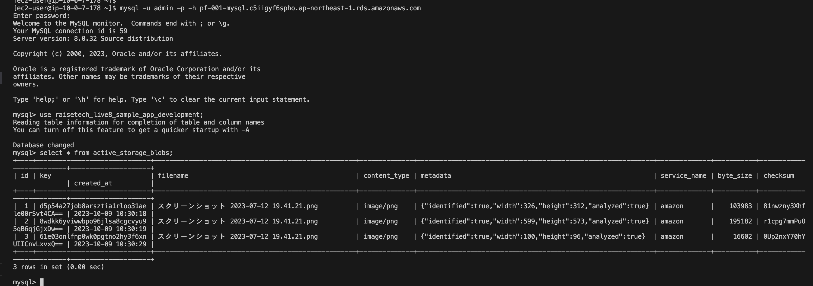

# pf-aws
クラウド関連の業務経験が無いので、
それを補うため以下の学習を行いました。

## AWS座学
2023年9月にSAAを取得。

## AWS実技

### 1.　マネージメントコンソールから以下構成を作成

- マネージメントコンソールからAWSリソース（VPC, ALB, EC2, RDS, S3, IAM）を作成
- EC2にアプリサーバ環境構築　（Rails + Nginx + Unicorn + mysql）

##### 構成図

### 2.　CloudFormationについて学習
- CloudFormationテンプレートから上記AWSリソース（VPC, ALB, EC2, RDS, S3, IAM）を自動作成

### 3.　circlciからcloudformaiton,Ancibleを使ってWEBアプリが動かす
- circleci、Ansibleを学習し、以下のものを作成しました。

  - GitHubにpushを行うだけでcircleciが以下を自動実行

    1. CloudFormationでAWSリソース( VPC, ALB, EC2, RDS, S3, IAM ) を作成
    2. AnsibleでWEBアプリサーバ環境構築 ＋ ソースコードをデプロイ
    3. ServerspecでWEBページ表示テスト

##### 構成図

- circleの全タスクが正常終了

- バケットに保存されていることを確認

- RDS内に投稿内容が保存されていることの確認

#### ソースコード

.circleci/config/yml
cloudformationテンプレート
ansible
sshconfig

## 今後の学習予定
- 実技
  - teraform
  - Auto Scaling
  - SNS+SQS
  - ECS,EKS
  - 監視・運用関連
  - （（　複雑なシェルスクリプト　））
  - などなど

- 資格
  - SAP　(Solutions Architect - Professional)
  - SOA  (SysOps Administrator Associate)
  - DVA  (Developer Associate)
  - セキュリティ
  - NW
  - 応用情報

- その他
  - AWSの設計関連書籍を読む