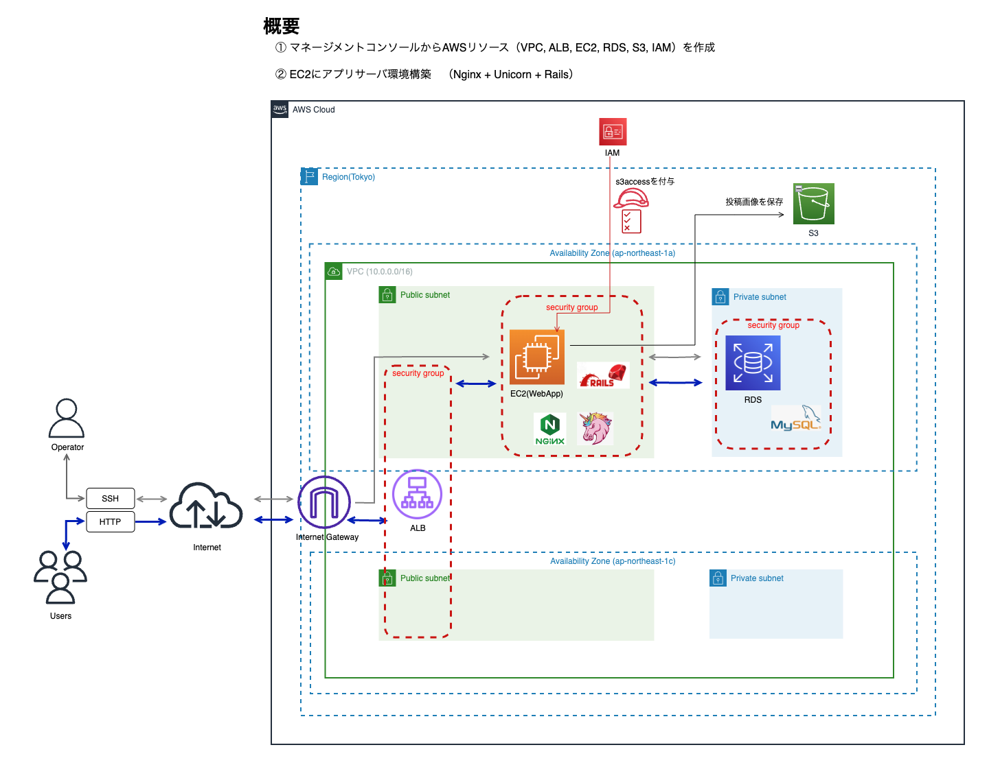
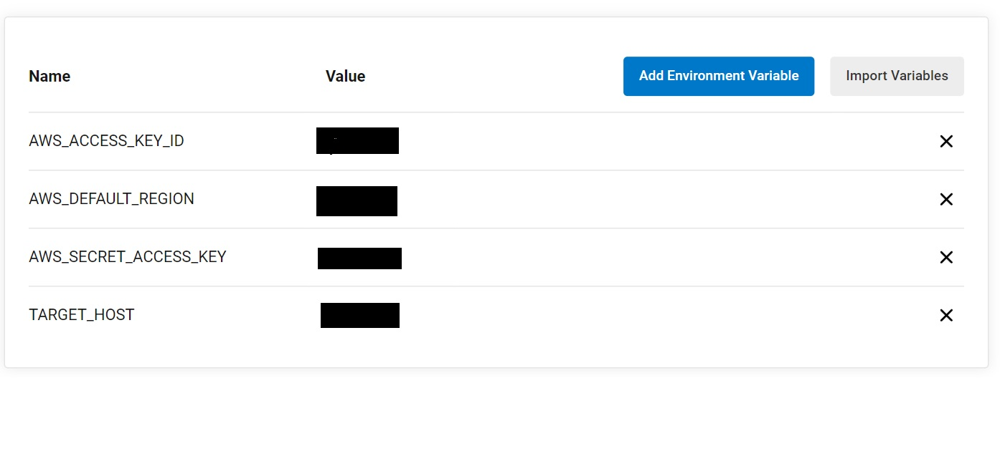
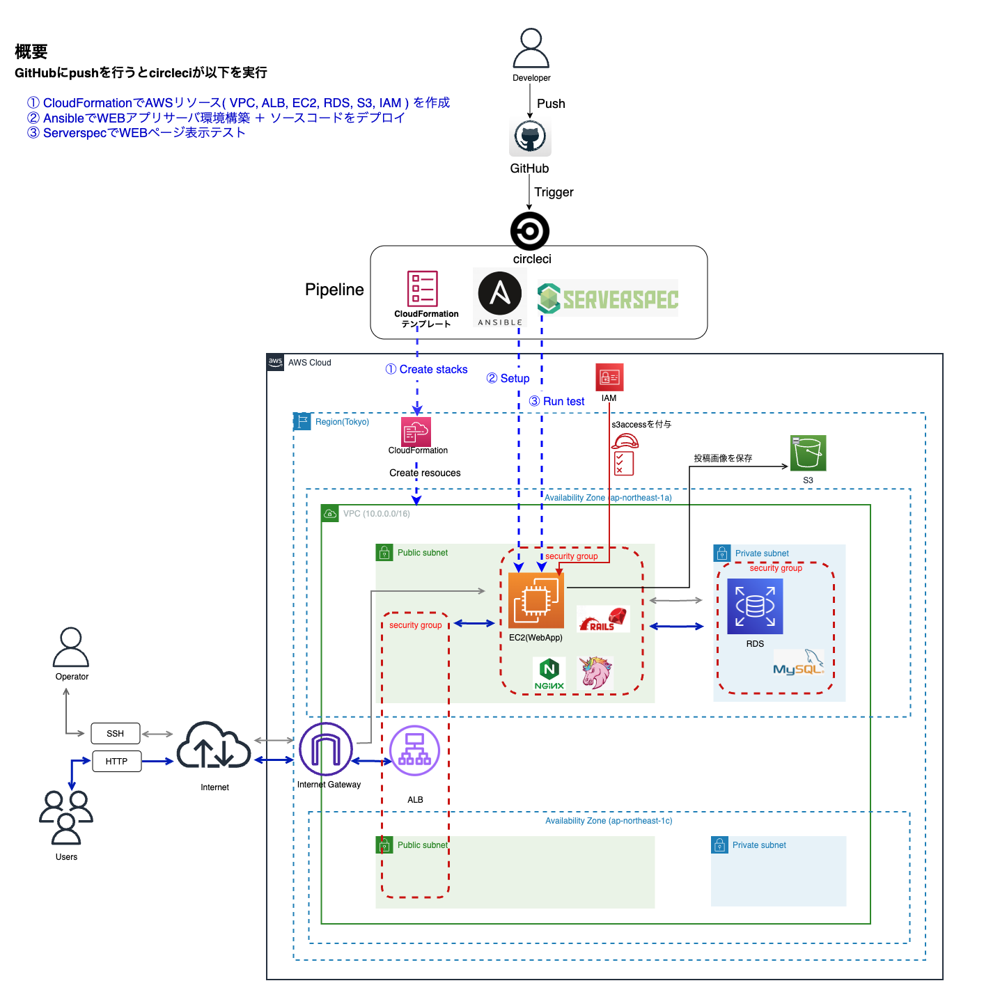
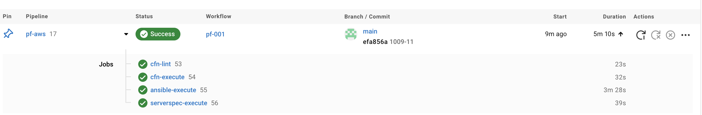
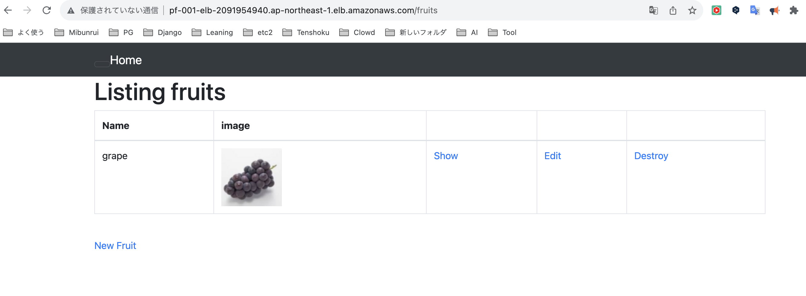
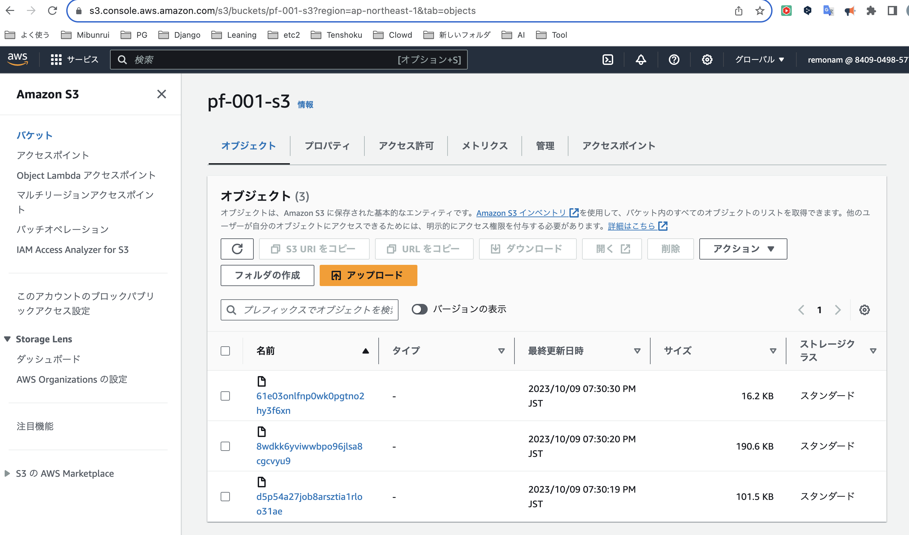

# AWS個人学習の内容
クラウド関連の業務経験が無いので
それを補うため以下の学習を行いました

## AWS座学
- 2023年9月にSAAを取得
  - 自分用ノートも作成

## AWS実技

### 1.　マネージメントコンソールから以下構成を作成

- マネージメントコンソールからAWSリソース（VPC, ALB, EC2, RDS, S3, IAM）を作成
- EC2にWEB/AP/DBサーバ環境構築　（Rails + Nginx + Unicorn + mysql）
  - Railsアプリは簡単なCRADを行うだけのものです。（投稿画像はS3に保存されます）   
- 追加で実施
  - Auto Scaling （当然AMI作成、起動テンプレート作成含む）

##### 構成図

### 2.　CloudFormationについて学習
- CloudFormationテンプレートから上記AWSリソース（VPC, ALB, EC2, RDS, S3, IAM）を自動作成

### 3.　circleciからCloudFormaiton,Ancibleを使ってWEBアプリが動かす
- circleci、Ansibleを学習し、以下のものを作成しました

  - GitHubにpushを行うだけでcircleciが以下を自動実行

    1. CloudFormationでAWSリソース( VPC, ALB, EC2, RDS, S3, IAM ) を作成
      - CloudFormationテンプレートに対してgitからのpush時にリンターツールでYAMLの構文チェックも実施。エラーになったら中止
      - 作成順: VPC →セキュリティグループ →EC2 →RDS →ALB →RDS →ALB →S3の順序で作成
    2. Ansibleのplaybookに基づき、WEB・APサーバの環境構築 ＋ WEBアプリのソースコードをデプロイ
      - playbookのroleの処理順序は以下の通り
        - yum > ruby > bundler > rails >node > yarn > railsコードデプロイ > mysql > DBマイグレーション > nginx > unicorn >
    3. Serverspecで動作環境チェックおよびWEBページ表示チェック
      - インストールチェック・バージョンチェック（ruby,bundler,rails,node,yarn,mysql,nginx,unicornがインストールされているか、バージョンは指定どおりか）
      - サービスチェック（nginx,unicornが起動しているか）
      - HTTPステータスチェック（正常 つまり200 OKが返ってくるか）

#### 動作環境
- ruby3.1.2
- bundler2.3.14
- Rails 7.0.4
- Node 16.19.1
- yarn 1.22.19
- DB: MySQL

#### circleci環境変数

#### 構成図

#### 動作後画面
- circleciの全タスクが正常終了

- 新規投稿した結果

- バケットに画像が保存されていることを確認

#### ソースコード

.circleci/config/yml
cloudformationテンプレート
ansible
sshconfig

## 今後学習したいもの
- 以下機能の実装
  - SNS,SQS, API Gateway、Lambda関数
  - TerraForm
  - 複雑なシェルスクリプト、
  - コンテナ技術（ECS,EKS,Kubernetes)
  - 監視・運用関連の技術
  - などなど

- 資格
  - SAP (Solutions Architect - Professional)
  - SOA (SysOps Administrator Associate)
  - DVA (Developer Associate)
  - SCS (AWS セキュリティ)
  - ANS （Advanced Networking - Specialty）
  - 応用情報処理
  - 情報安全確保支援士

- その他
  - AWSの設計関連書籍を読む
